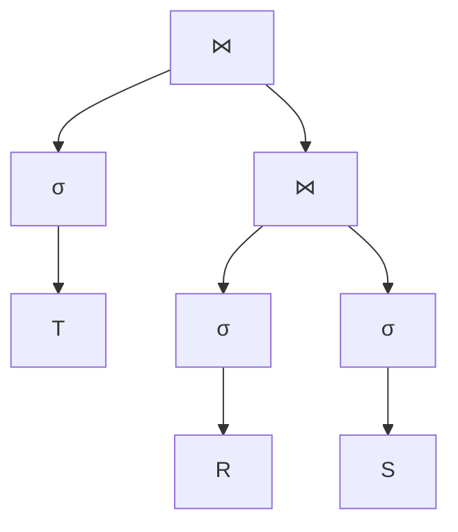

# Ratchet

Ratchet is a prototype system for efficient fine-grained data analytic suspending and resuming 

Ratchet implementation is modified from DuckDB v0.7.1.

~~Ratchet implementation is modified from DuckDB v0.6.1.~~

## Third-Party

It is highly recommended to add third-party libs whose whole source code is in a single header file. Then, you can add them by,

1. copying the header file of the third-party lib to `third_party` folder
2. adding `include_directories(third_party/xxx)` after `include_directories(src/include)` in the `CMakeLists.txt` at the root directory. You may have to recompile the source code if needed.
3. if you are working on Python client, you also need to update `third_party_includes()` in `scripts/package_build.py`. You may have to reinstall python client to reflect the change.

### JSON for Modern C++ 

We import the `nlohmann/json` to serialize and deserialize JSON. Github: https://github.com/nlohmann/json

## Prerequisite

Install pybind11 using `pip3 install pybind11` (system-wide or virtual environment)

`pip3 show pybind11` will tell you where is the pybind11

If you are using CLion IDE for development, and make sure CLion can link all the source code, you may need to add `-DBUILD_PYTHON_PKG=TRUE -DCMAKE_PREFIX_PATH=/path/to/pybind11` in `Settings | Build, Execution, Deployment | CMake | CMake Options`. This will tell CLion where to find pybind11. 

## Python Client

Ratchet-DuckDB can be used and tested by a python client. It is recommended to install the python client in a python virtual environment.

```bash
source <path/to/python-virtual-environment/bin/activate>
cd <Ratchet-DuckDB>/tools/pythonpkg 
python setup.py install
```

### Modifying Python Client APIs 

When you want to add a new Python API or modify an existing one for DuckDB especially for virtual environments, you need to:
1. Install `mypy` python library in the virtual environment
2. Modify the source code in `tools/pythonpkg/src` to reflect to API change 
3. Run `scripts/regenerate_python_stubs.sh` at the **root directory of DuckDB**, making sure `<Ratchet-DuckDB>/tools/pythonpkg/duckdb-stubs/__init__.pyi` already reflect the API change 
4. Install the modified DuckDB again using `python setup.py install` in `<Ratchet-DuckDB>/tools/pythonpkg`
5. If you still cannot apply the change you made for Python Client APIs, please repeat 3,4 for mutiple times, you should be fine.

## TPC-H Benchmark

First, you need to generate the original tables using TPC-H tools and then move them to `dataset/tpch/tbl` folder. Simply running `duckdb_tpch_data.py` can convert the table files to `parquet` or `csv` format using, for example, the following command,
```bash
python3 duckdb_tpch_data.py -d dataset/tbl/sf1 -f parquet -rgs 100000
```
You can move the converted data to any folder you want.

`tpch_perf` will trigger the original TPC-H queries from q1 to q22. For example,
```bash
python3 tpch_perf.py -q q1 -d dataset/parquet/sf1 -td 1
```
The above command will run `q1` in TPC-H based on the data from `dataset/parquet/sf1` using `1` thread.


## Three-way Join Example

Following the example in "morsel-driven parallelism" paper, we conduct a three-way join query, as shown in the following example:

